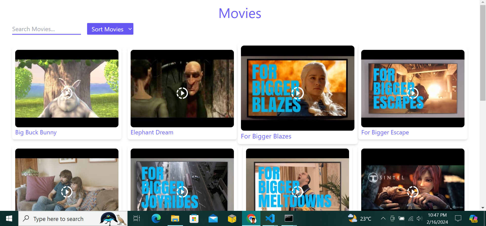
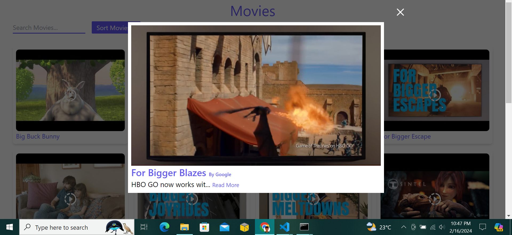

# Video Player Application

## Command
### npm run start (to start the server)
### npm run build (to build the server at production)

## Tech Stack
### 1. Webpack (for HMR, bundles & chunks)
### 2. ReactJS (For SPA)
### 3. Typescript (For type checking)
### 4. Tailwind CSS 

## Functionality 
### 1. Clicking on any image will open the video player (the video will run automatically).
### 2. Video can be watched with full screen too.
### 3. Searching (using debouncing) & sorting functionalities are given.

#### Thank you

